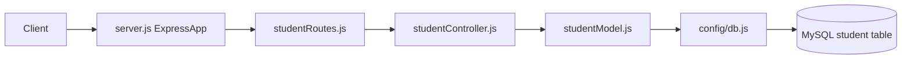

# Whole-System Analysis Plan

## Scope
Analyze the full backend system at a high level, covering API architecture, request/data flow, database integration, configuration, and quality/operability signals.

## Codebase Areas To Review
- App bootstrap and runtime wiring: [`C:/Users/woore/Documents/School-management-system-node/server.js`](C:/Users/woore/Documents/School-management-system-node/server.js)
- Route layer: [`C:/Users/woore/Documents/School-management-system-node/routes/studentRoutes.js`](C:/Users/woore/Documents/School-management-system-node/routes/studentRoutes.js)
- Controller layer: [`C:/Users/woore/Documents/School-management-system-node/controllers/studentController.js`](C:/Users/woore/Documents/School-management-system-node/controllers/studentController.js)
- Data/model layer: [`C:/Users/woore/Documents/School-management-system-node/models/studentModel.js`](C:/Users/woore/Documents/School-management-system-node/models/studentModel.js)
- DB configuration: [`C:/Users/woore/Documents/School-management-system-node/config/db.js`](C:/Users/woore/Documents/School-management-system-node/config/db.js)
- Project/runtime metadata: [`C:/Users/woore/Documents/School-management-system-node/package.json`](C:/Users/woore/Documents/School-management-system-node/package.json)
- Environment and ignore policy: [`C:/Users/woore/Documents/School-management-system-node/.env`](C:/Users/woore/Documents/School-management-system-node/.env), [`C:/Users/woore/Documents/School-management-system-node/.gitignore`](C:/Users/woore/Documents/School-management-system-node/.gitignore)
- Quality signals/tests: [`C:/Users/woore/Documents/School-management-system-node/controllers/studentController.test.js`](C:/Users/woore/Documents/School-management-system-node/controllers/studentController.test.js), [`C:/Users/woore/Documents/School-management-system-node/models/studentModel.test.js`](C:/Users/woore/Documents/School-management-system-node/models/studentModel.test.js)

## Analysis Dimensions
- Architecture map: identify layers, responsibilities, and coupling points.
- Request-to-database flow: validate how each endpoint traverses route -> controller -> model -> DB.
- Configuration posture: verify env usage vs hardcoded settings and startup assumptions.
- Error-handling posture: check consistency of status codes/messages and failure boundaries.
- Data-layer posture: inspect query style, update semantics, and schema assumptions.
- Quality/operability posture: summarize tests, missing automation, and deployment readiness signals.

## Deliverables
- System architecture overview (components + responsibilities).
- Endpoint flow summary and dependency map.
- Risks/gaps list prioritized by severity (high/medium/low).
- Actionable improvement checklist grouped by:
  - security/configuration
  - maintainability/structure
  - testing/CI
  - operations/deployment

## System Flow Diagram

## Approach
- Read the core files in sequence (bootstrap -> routes -> controller -> model -> config).
- Cross-check with tests and scripts to validate intended behavior vs enforcement.
- Produce a concise, prioritized report focused on practical next steps for the current codebase maturity.